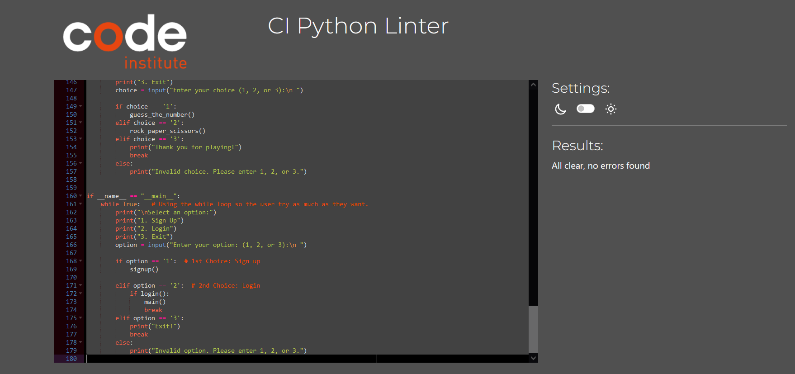

Welcome,

## Python Games

- There are 2 different games in this project.
- 1st game is Guess a number
   - In this game, the user has unlimited tries to guess a pre-determined random number between 1 and 100.
   - If the guess is higher than the random number, the game will tell you that it is too high.
   - If the guess is lower than the random number, the game will tell you that it is too low.
   - It will keep going on until user guess the correct number.
- 2nd game is Rock Paper Scissors, a classic that doesn't need any introduction.

## ## Project Goals
### User Stories

- Play both games.
- Be able to sign up as a new user.
- Be able to login as existing an user.
- Be able to choose any game.

### Site Owner Goals

- Create a game which is easy and clear to user.
- Ensure that new user is able to signup.
- Ensure that existing user can login.
- Ensure errors are handled and displayed to user.
- Ensure that user is able to understand the game.

## User Experience
### Target Audience

- There is no specific audience for the game as both games are basic and can be played by any age group.

### User Requirements and Expectations

- A simple and fun game.
- Straightforward Navigation.
- Log-in works as expected and incorrect details do not allow the user access to their account.

#### Launch Game

- On loading the game, users are presented with the option of sign up, login and exit.
- On login, users are presented with the choices of choosing any of the game mentioned above.

#### Sign Up

- If user is a new player, they will be required to sign up.
- User will be required to enter a new name and password.
- Once sign up is successful, user will be ask to login to play the game.
- Operation: Sign Up Here
- Enter New Username
- Enter New Password

#### Login

- If user is an existing user, they will be asked to enter username and password
- If it matches will the data, the user will be logged in.
- A welcome message on the screen will be displayed for the users with their name
- The input goes through a validation process. If the user input is not correct they have an option to try again .

### User Stories
## Users

- I want  have an option as an existing user or new user.
- I want to be able to signup as new user.
- I want to be able to choose different games.
- I want to be able to log-in if I return to the game.
- I want to be able to exit.

## Site Owner

- I want users to have a positive experience while playing the game.
- I want user names and password to be saved to Google Spreadsheet when signing up.
- I want the user to get errors displayed in case of wrong input.
- I want data entry to be validated, to guide the user on how to correctly format the input.

### Technology Used
## Language Used

- Python.

## Python Libraries used
- GSpread - to connect with google sheets.
- Random - used to choose random words.
- Strip - to remove any spaces.

### Other websites/tools used

- GitHub was used for saving and storing files.
- GitPod was the IDE used for writing code.
- Heroku was used as the deploying platform for this site.

### 3rd Party Python Libraries used
- Google sheets API was used to store and check the user input and authorize the user identity
- Google OAuth was used to connect the project with the google account.

### Manual Testing

1. I want to be able to have an option as sign up or login.

    
Screenshots

    
Sign Up Successful

    

 

2. I want to able to signup as new user
    

    
Screenshots

    
Sign Up Successful

    
    
Sign Up Unsuccessful

    

 

3. I want to be able to log-in if I return to the game

    
Login Unsuccessful

    
    
Login Successful

    

 

4. I want to be able to see the games option after successful login.

    
Screenshots
   
    
Games Options

       

 

5. I want to be able to play both games and see the expected results

    
Screenshots
   
    
Guess the number. Attempts conditons + win condition.

    
    
If the guess is not in the range or if it is not an integar

    
    
Rock Paper Scissor Invalid Choice

     
    
Rock Paper Scissor Valid Choice

      

6. I want users to update spread_sheet up signup

    
Screenshots

    
Spread_Sheet

      
    
Updated Spread_Sheet after successful sign up

    
      
    

7. I want user to exit easily

    
Screenshots

    
Exit

          

 

## Validator Testing

 - Tested the code on Pep8 (Recommended by code institute) and found no errors.
   
Validating the code

          

 - Test manually by entering incorrect numbers, out of range numbers, alphabets and characters and it worked fine.

## Testing on Browsers

  - I tested that this game works in 2 browsers - Chrome and Safari and was able to deploy successfully on both of them.

# Bug and Fixes

### Bug
 - The User could put the same name as one stored in the spreadsheet and it will still sign up.
### Fix
 - Fetch the data from the spreadsheet, stored in a new variable and compare with the input data. So the user cannot sign up with the same name.

### Bug
 - The User could not login in.
### Fix
 - Used the strip function to remove extra spaces while comparing with user data to the data stored in the spread sheet.

### Bug
 - The User could enter any integar while the game was guess a number between 1 and 100.
### Fix
 - Used the if condition to see if the number is less than 100 and more than 1.

## Deployment
 - The project was deployed by following these steps (Different from Html and Java Script deployment): 
   - Create a repository using code institute template.
   - Make an account on Heroku.
   - Build packs with the following order: Python, NodeJS.
   - Updated pack by adding Key: Port and Value: 8000.
   - Link the Heroku with the repository.
   - Wait until it builds.
   - Deploy

## Credits
 - To my mentor, Mo Shami regarding the project ideas.
 - Code institute for their thorough guide on Heroku deployment.

